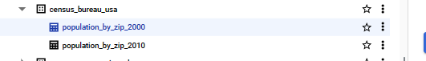

# dbt-template

[](https://github.com/obar1/dbt-template/actions/workflows/makefile.yml)

simple dbt project template with some models
- load some csv export to local **duckdb** for local-first dev
- **fake_seeds**: adv seed moking [here](./py_scripts/fake_seeds/fake_seeds.md)

> data samples from
> https://console.cloud.google.com/marketplace/product/united-states-census-bureau/us-census-data?project=future-force-421706
> 

## makefile interface for cmd line usage

use makefile [here](./Makefile)

## basic usage

- load sample data in local db
```shell
make loaddb0
```

- have a look at the data loaded
```shell
make connectdb0
```

- create fake seeds
> handy to create sample data - especially when you have no accesa to  the actual data but you have metadata info

[here](./py_scripts/fake_seeds.md)

- run dbt 
```shell
make run
```

- have a look at the models generated
```shell
make connectdb0
```

## dbt extensions

def I suggest [innoverio.vscode-dbt-power-user](https://github.com/AltimateAI/vscode-dbt-power-user)
