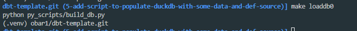
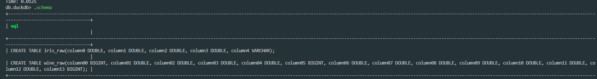
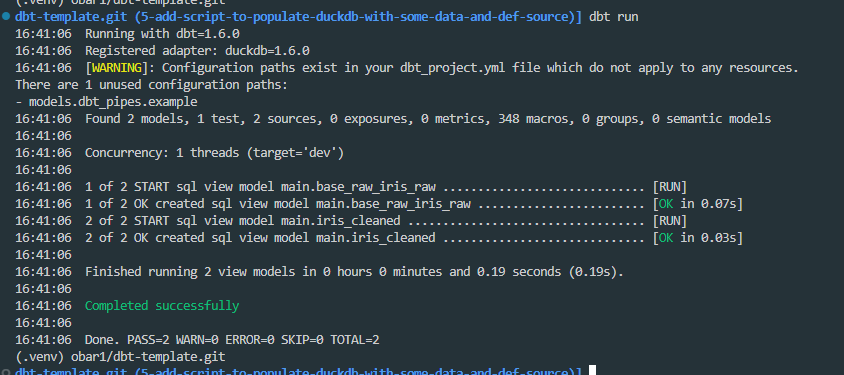
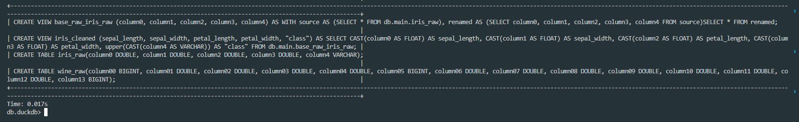
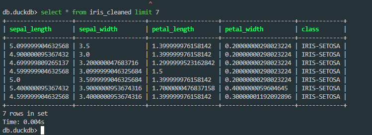
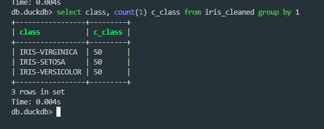

# dbt-template

[](https://github.com/obar1/dbt-template/actions/workflows/makefile.yml)

simple dbt project template with some models
- load some data from http://archive.ics.uci.edu/ to local duckdb
- simple dataflow using `dbt`

- **fake_seeds**: adv seed moking [here](./py_scripts/fake_seeds/fake_seeds.md)

## makefile intreface for cmd line usage

use makefile [here](./Makefile)

## basic usage

- load sample data in local db
```shell
make loaddb0
```


- have a look at the data loaded
```shell
make connectdb0
```


- create fake seeds
> handy to create sample data - especially when you have no accesa to  the actual data but you have metadata info

[here](./py_scripts/fake_seeds.md)

- run dbt 
```shell
make run
```


- have a look at the models generated
```shell
make connectdb0
```



...


> do the same for wine ... :)

## a bit more advanced usage

- look at the usage of the seeds prefixed by `qa_expected...`, each of them are used in the test folder to have some minimal **regression test** ...
> without them, if you change your models you are going to do quite a `$hiTTy JOB$` as other dependencies might break, it's like actual and expected in pytest...

### test

apart the dbt test you can see [here](https://docs.getdbt.com/docs/build/tests)
logically we can def 3 categories of test
- test macro logic
- test that expected values in each model using `qa_expected...` as input match 
> this is simple and effective way to do integration test ...  anything changing in your model or csv input likely will break the test
- some BL test
> high level Business logic test not easy to ingest in yaml 

```shell
 find . -type f
.
./macros
./macros/adult
./macros/adult/test_convert_income.sql = test macro logic
./1cleaned
./1cleaned/qa_expected_iris_cleaned.sql = test iris_cleaned values
./2model
./2model/asset_iris_match.sql = assert on some BL logic
./2model/qa_expected_iris_model.sql = test iris_model values
 
```

## dbt extensions

def I suggest [innoverio.vscode-dbt-power-user](https://github.com/AltimateAI/vscode-dbt-power-user)
