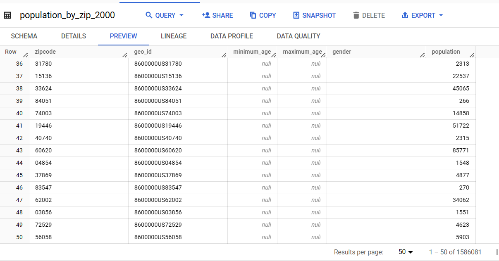
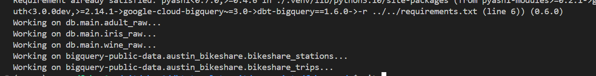
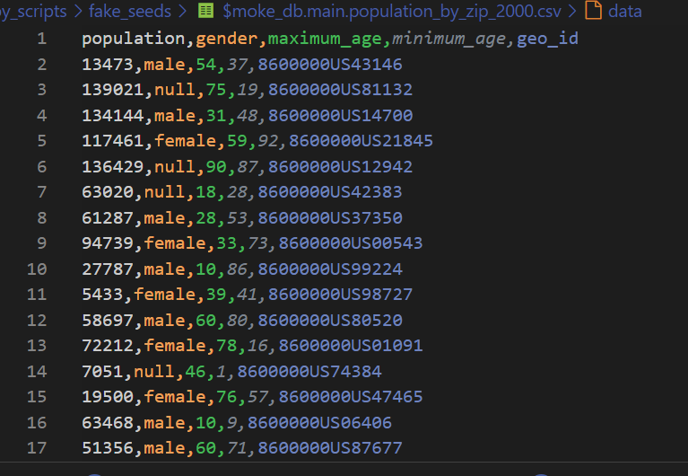

# fake dbt seed

Very often when working on new data projects you might have access to `some` metadata but not the actual `data` but you want to create `some` meaningful dbt seeds with little intervention... to explore the actual requirements to deliver new dbt models.
> while we get access to dev data or masked pre-prod exports :) 
> if you are in the data eng field, you might be familiar with this ...


## Export metadata

> currently supporting duckdb and bigquery

get the metadata from:

### duckdb

https://duckdb.org/docs/sql/information_schema.html#information_schemaschemata-database-catalog-and-schema

template is [here](./duckdb-metadata-export.sql)

```shell
cd py_scripts/fake_seeds
duckcli  ../../db.duckdb < duckdb-metadata-export.sql
```


### bigquery
https://cloud.google.com/bigquery/docs/information-schema-intro

template is [here](./bigquery-metadata-export.sql)

```ps1
cd py_scripts/fake_seeds
bq query --format=csv  --use_legacy_sql=false < bigquery-metadata-export.sql > bigquery-metadata-export.csv
```

### diff

each one is a bit different about the metadata export:

```
for `duckdb` we have
+-----------+
| BIGINT    |
| DOUBLE    |
| VARCHAR   |
+-----------+

for `bigquery` we have
data_type
INT64
STRING
FLOAT64
DATE
```


we add the db_id column in the export to be used in the next step...

## Reviewing the metadata export

Once you have the metadata csv export 

Samples: 
- [bq](./bigquery-metadata-export.csv)
- [duck](./duckdb-metadata-export.csv)

you can add `extra` column and make some customization so data is more useful in the real dbt project


supported:

- regex pattern
- list from values
- min and max ranges


ex
```py
pattern=^[A-Z]{3}XXXX[0-9]{2}$
list=active|closed
range=20|40
```

## Running the code

```bash
cd py_scripts/fake_seeds/

python fake_seeds.py bigquery-metadata-export.csv 100000
python fake_seeds.py duckdb-metadata-export.csv 50000
```


## Running the code with extra info

These tables come from bq sample dataset


```
Number of rows
1,586,081
```

we can tune the [metadata](./duckdb-metadata-export.csv) with `extra` setting, just looking at the real data



sample here 
[metadata-extra](./duckdb-metadata-export-extra.csv)

simply run and create the new synthetic data

```bash
python fake_seeds.py duckdb-metadata-export-extra.csv 3000000
```


> a couple of mins,,,`this is not performant parallel code`  but it works
> and contents looks ok :) just `dbt seed` the csv and we have new synthetic data...



