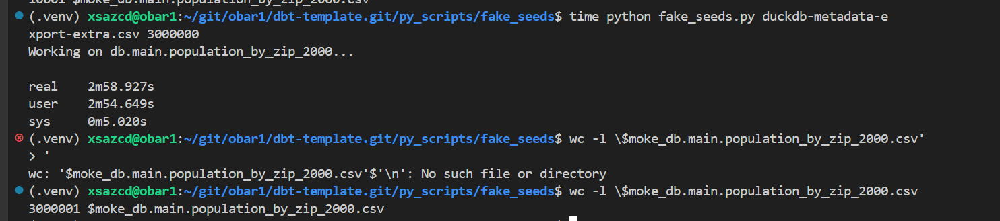

# fake dbt seed

> given `some` metadata we want to create `some` meaningful dbt seeds with little intervention...
> while we get access to dev data or masked pre-pord exports :) 
> if you are in the data-eng field, you might be familiar with this ...


## Export metadata

> currently supporting duckdb and biquery

get the metadata as

### duckdb

template is [here](./duckdb-metadata-export.sql)

```shell
cd py_scripts
duckcli ../db.duckdb < duckdb-metadata-export.sql 
```

https://duckdb.org/docs/sql/information_schema.html#information_schemaschemata-database-catalog-and-schema

### bigquery

template is [here](./bigquery-metadata-export.sql)

```ps1
cd py_scripts
bq query --format=csv  --use_legacy_sql=false < bigquery-metadata-export.sql > bigquery-metadata-export.csv
```
https://cloud.google.com/bigquery/docs/information-schema-intro

```
for `duckdb` we have
+-----------+
| BIGINT    |
| DOUBLE    |
| VARCHAR   |
+-----------+

for `bigquery` we have
data_type
INT64
STRING
FLOAT64
DATE
```

we have to add the db_id columnm in the export to be used in the next step.. 

## Reviewing the metadata export

Once you have the metadat csv export you can use it or add some `extra` :) 

Samples: 
- [bq](./bigquery-metadata-export.csv)
- [duck](./duckdb-metadata-export.csv)

you can add `extra` column and make some customization so data is more useful in the real  dbt project

ex
```
db_id,table_catalog,table_schema,table_name,column_name,data_type,extra
bigquery,bigquery-public-data,austin_bikeshare,bikeshare_stations,station_id,INT64,pattern=^[A-Z]{3}XXXX[0-9]{2}$
...
bigquery,bigquery-public-data,austin_bikeshare,bikeshare_stations,status,STRING,list=active|closed
...
bigquery,bigquery-public-data,austin_bikeshare,bikeshare_stations,footprint_length,INT64,range=20|40
bigquery,bigquery-public-data,austin_bikeshare,bikeshare_stations,footprint_width,FLOAT64,
```

supported:

- regex pattern
- list from values
- min and man ranges


## Running the code

```bash
$ cd py_scripts/fake_seeds/

$ python fake_seeds.py bigquery-metadata-export.csv 100000
$ python fake_seeds.py duckdb-metadata-export.csv 50000
```

ex:
- metadata 


- seed data


> run again python code and data changes each time


## demo

simple demo [here](./demo.sh)


